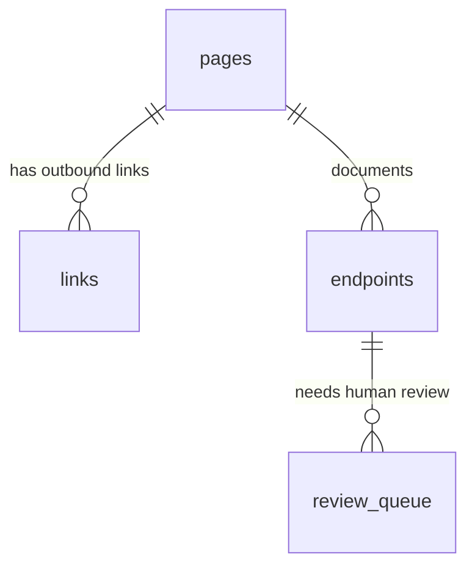
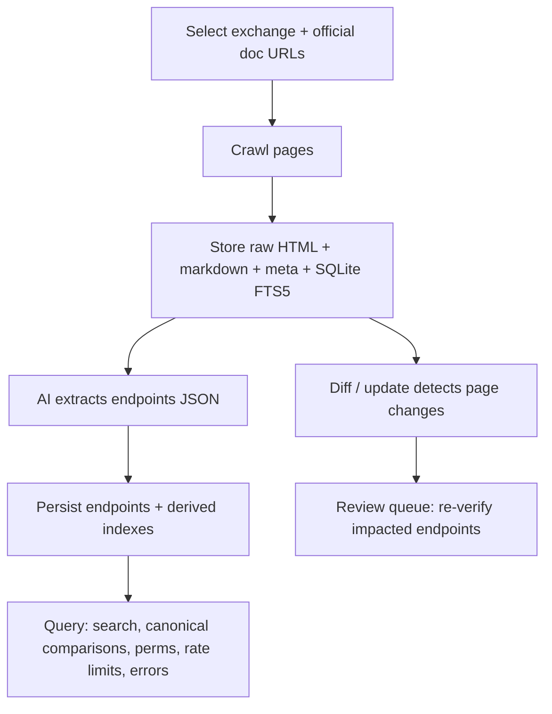

# feat: CEX API Docs Intelligence Layer

## Overview

Build an AI-native system for crawling, understanding, and structuring cryptocurrency exchange API documentation into a deterministic local knowledge base:

- `doc-crawler`: general-purpose doc crawler and SQLite FTS5 index
- `cex-api-docs`: CEX/DEX-specific extraction layer (endpoints, rate limits, permissions, canonical ops mapping, CCXT cross-reference, bilingual support)

This plan is grounded on the existing draft package in `cex-api-docs-plan-handoff/`.

## Enhancement Summary

**Deepened on:** 2026-02-09

### Key Improvements Added In This Pass

1. Identified and planned a resolution for schema and script mismatches between `doc-crawler` and `cex-api-docs` drafts (unified store + SQLite schema approach).
2. Added concrete operational and data-quality requirements (review queue noise control, re-review on source page hash change, reproducible dependency strategy).
3. Added security and compliance guidance for crawling (domain scoping, SSRF controls, robots and ToS posture, webhook secret handling).
4. Added performance and scalability considerations (incremental crawls, bounded storage, FTS rebuild strategy, avoiding O(n) JSON scans for common queries).

## Current State (Local Research)

- Repo root currently contains only `cex-api-docs-plan-handoff/` plus a few macOS metadata files.
- Draft briefing: `cex-api-docs-plan-handoff/CLAUDE.md`
- Draft skill package: `cex-api-docs-plan-handoff/doc-crawler/doc-crawler/`
- Draft skill package: `cex-api-docs-plan-handoff/cex-api-docs/cex-api-docs/`
- Key reference doc: `cex-api-docs-plan-handoff/doc-crawler/doc-crawler/references/storage-schema.md`
- Key reference doc: `cex-api-docs-plan-handoff/cex-api-docs/cex-api-docs/references/endpoint-schema.md`
- Key reference doc: `cex-api-docs-plan-handoff/cex-api-docs/cex-api-docs/references/canonical-ops.md`
- Key reference doc: `cex-api-docs-plan-handoff/cex-api-docs/cex-api-docs/references/exchanges.md`
- Institutional learnings were not found because `docs/solutions/` does not exist yet in this repo.

Notable gaps spotted in the draft (to address during implementation):

- `doc-crawler` SKILL references an `index.py`, but the draft scripts are `crawl.py`, `search.py`, `diff.py`.
- `doc-crawler/scripts/crawl.py` crawl log JSONL newline write appears incorrect (string continuation), which would break line-delimited log output.
- `doc-crawler/scripts/crawl.py` computes `content_hash` from raw HTML but the schema reference implies a hash of extracted markdown; pick one and align code + docs.
- `doc-crawler/scripts/crawl.py` does not mark pages stale on 404 recrawl, but `diff.py` reports `is_stale`.
- `doc-crawler/scripts/crawl.py` auto-installs dependencies at runtime, which may be undesirable for reproducibility.
- `cex-api-docs/scripts/save.py` and `doc-crawler/scripts/crawl.py` define incompatible `pages` table schemas; `cex-api-docs/scripts/cex_search.py` also queries `pages.word_count` and `pages.link_depth`, so the drafts will not work together without unification.
- `cex-api-docs/scripts/cex_update.py` references a missing `cex_crawl.py` and has a newline bug in Slack formatting (string-join).
- Multiple scripts install dependencies at runtime (`requests`, `pyyaml`), which is risky for reproducibility and supply-chain control.

## Problem Statement / Motivation

Exchange API documentation is fragmented, frequently updated, inconsistent across exchanges, and often deeply nested. Developers and agents need:

- Offline, fast lookup of endpoint details (params, permissions, rate limit weights, errors)
- A deterministic index that can be diffed between crawls
- Cross-exchange comparisons using a canonical vocabulary (ex: `get_open_orders`)
- A human review loop for ambiguous or inferred fields

Existing tools do not solve this fully:

- CCXT abstracts away exchange-specific details and is incomplete for rate limit weights and permissions.
- Generic doc indexers do not extract domain-specific structured endpoint data.

## Goals

- Provide a reliable local store of crawled docs with provenance (URL, timestamp, content hash).
- Enable fast search and retrieval via SQLite FTS5 (no embeddings required for MVP).
- Extract a structured endpoint dataset for at least one exchange (MVP: Bybit v5).
- MVP dataset fields include: endpoint method/path/base URL, parameters/headers, rate limits and permissions when documented, error codes when available, canonical operation mapping for a small starter set, confidence scoring, and review queue workflow.
- Support change detection between crawls and a reportable update process.

## Non-Goals (Initial Release)

- 100 percent coverage of all exchanges listed in `references/exchanges.md`
- A hosted web UI
- Vector search or embedding pipelines
- Automated endpoint extraction that replaces the AI-native approach (scripts stay deterministic I/O)

## Proposed Solution

### High-Level Architecture

Core decision from the draft: the agent handles understanding; scripts handle deterministic I/O.

- AI agent responsibilities include deciding what to crawl, extracting endpoint data, mapping to canonical ops, bilingual handling, and optional CCXT cross-reference.
- Script responsibilities include persistence, SQLite FTS5 indexing and queries, diff/change detection, review queue state, and update runner automation.

### Research Insights

**Unify the data store** so `doc-crawler` and `cex-api-docs` share one directory and one SQLite database. This avoids:

- duplicated page storage
- incompatible `pages` schemas
- slow scans of JSON files when FTS can answer the query

**Proposed default store root:** `./cex-docs` (override via `--docs-dir` / `--output-dir`).

### Unified Store Layout (Target)

```text
cex-docs/
  db/
    docs.db
  raw/
    {domain}/{path_hash}.html
  pages/
    {domain}/{path_hash}.md
  meta/
    {domain}/{path_hash}.json
  endpoints/
    {exchange}/{section}/
      {METHOD}_{path_safe}.json
  crawl-log.jsonl
```

### SQLite Data Model (Target)

**Base:** the richer `doc-crawler` schema for pages, links, and crawl runs.

**Extension:** add `endpoints`, `endpoints_fts`, and `review_queue` (from `cex-api-docs/scripts/save.py`) to the same `docs.db`.

**Proposed key relationship to enable change impact:** add `endpoints.source_page_url` (or `source_page_id`) so a page content hash change can trigger re-review of the endpoints extracted from that page.



### Deterministic Script Contracts (Target)

- `doc-crawler/scripts/crawl.py`: writes `raw/`, `pages/`, `meta/`, `db/docs.db`, and `crawl-log.jsonl`.
- `doc-crawler/scripts/search.py`: queries `db/docs.db` (FTS5) and fetches pages by URL.
- `doc-crawler/scripts/diff.py`: reports new, updated, and stale pages using `content_hash` + `prev_content_hash`.
- `cex-api-docs/scripts/save.py`: persists endpoint JSON to `endpoints/` and indexes it in `db/docs.db`; manages `review_queue`.
- `cex-api-docs/scripts/cex_search.py`: prefers `endpoints_fts` and indexed columns over filesystem scans; falls back to file scans only if needed.
- `cex-api-docs/scripts/cex_update.py`: orchestrates periodic re-crawls and diff reporting; optional Slack alerting.

### Target Repo Layout (After Migration)

```text
doc-crawler/
  SKILL.md
  scripts/
  references/

cex-api-docs/
  SKILL.md
  scripts/
  references/

docs/
  plans/
  runbooks/
```

## SpecFlow Analysis (Flows, Permutations, Gaps)

### Workflow Overview



### Permutations Matrix (What Must Be Supported)

| Dimension | Variants | Notes |
|---|---|---|
| Rendering | server-rendered HTML, JS-rendered SPA | JS fallback via Playwright for empty HTML |
| Docs structure | single site, multiple sites per exchange | ex: Binance spot vs futures vs PM |
| API style | REST, websocket, JSON-RPC-like | ex: Hyperliquid is not REST |
| Versioning | explicit versioned, unversioned | must record api_version and "latest" assumptions |
| Rate limits | simple, parameter-dependent, VIP tiers | must store "weight_conditions" and notes |
| Permissions | clearly stated, scattered, undocumented | explicitly store "undocumented" instead of guessing |
| Language | English only, bilingual, Korean only | store original + translation where relevant |
| Access | public docs, soft-blocked, hard-blocked (captcha/login) | define behavior and escalation path |

### Missing Elements / Gaps To Specify Upfront

- Robots and ToS compliance policy: what to do if `robots.txt` disallows crawling?
- Request identity: consistent `User-Agent`, contact info, per-domain throttling defaults.
- Retry and backoff strategy: 429/5xx handling, max retries, and crawl cancellation.
- Canonical ops governance: how new canonical ops are proposed and accepted.
- Review queue policy: who approves, how "verified" is recorded, when re-review triggers.
- Data validation: schema validation for endpoints JSON before writing to storage.
- Handling duplicate content: same endpoint documented on multiple pages, or multiple languages.
- Handling doc deprecations: marking legacy versions and preventing "latest" ambiguity.

### Research Insights (Recommended Defaults)

**Compliance posture (default):**

- Respect `robots.txt` by default and provide an explicit override flag for local/dev experimentation.
- Add an allowlist-only model for crawl targets: always require an explicit `domain_scope` per crawl, and reject off-domain navigation.

**Reliability posture (default):**

- Retry policy: bounded retries with exponential backoff for 429/5xx; never infinite retries in cron.
- Capture the final, redirected URL and treat it as canonical for future diffs (reduces churn).
- Persist a crawl run record including config to make diffs reproducible.

**Data quality posture (default):**

- Enforce endpoint JSON provenance at write-time (must include `source.url`, `source.crawled_at`, `source.content_hash`).
- Add a cheap JSON schema validation step before `save.py` writes to disk or DB.
- Reduce review noise: only enqueue review items for fields that explicitly carry `confidence != high` (avoid auto-enqueueing lists like `error_codes` with no confidence metadata).

### Critical Questions Requiring Clarification

1. Should this repo become the canonical home for the two skills (migrating out of `cex-api-docs-plan-handoff/`), or do you want to keep the handoff folder and publish from there?
2. Where should the default storage live for crawls and extracted data?
3. What is the minimum "done" for the MVP exchange (Bybit)?
4. Do you want Slack notifications in `cex_update.py` as part of MVP, or keep alerts stdout-only initially?
5. How strict should the crawler be about respecting `robots.txt` and ToS?

## Implementation Plan (Phased)

### Phase 0: Repo Bootstrap (Structure and Docs)

- [ ] Create top-level `README.md` describing the project, the AI-native split, and a quickstart.
- [ ] Create a top-level `CLAUDE.md` capturing "what is decided" (mirroring `cex-api-docs-plan-handoff/CLAUDE.md`).
- [ ] Migrate draft skill packages from `cex-api-docs-plan-handoff/` into the target repo layout.
- [ ] Add `docs/runbooks/` with step-by-step instructions for running a crawl and validating output.
- [ ] Make the exchange registry machine-readable for automation:
- [ ] Add a source-of-truth file (example: `cex-api-docs/references/exchanges.yaml`) that `cex_update.py` can parse without scraping markdown.
- [ ] Keep `cex-api-docs/references/exchanges.md` as human-readable docs, either generated from YAML or explicitly kept in sync.

### Phase 1: `doc-crawler` Hardening (Deterministic Storage + Search)

- [ ] Align `doc-crawler/SKILL.md` with actual scripts (either add missing `index.py` or update docs to match reality).
- [ ] Fix crawl log JSONL newline behavior and verify `crawl-log.jsonl` is valid line-delimited JSON.
- [ ] Align `content_hash` semantics (HTML vs extracted markdown) across code and `references/storage-schema.md`.
- [ ] Ensure 404s set `is_stale=1` for pages, so `diff.py` can report removals.
- [ ] Decide dependency strategy option: keep runtime auto-install.
- [ ] Decide dependency strategy option: replace with `requirements.txt`/`pyproject.toml` and fail fast when deps are missing.
- [ ] Validate storage schema matches `references/storage-schema.md` and is consistent across scripts.
- [ ] Add crawl guardrails: `--max-pages`, `--timeout`, and a clear cancellation strategy.
- [ ] Add a crawler policy surface: explicit `--user-agent`, `--respect-robots`, and per-domain delay overrides.
- [ ] Confirm `doc-crawler/scripts/search.py` supports free text query via FTS5.
- [ ] Confirm `doc-crawler/scripts/search.py` supports listing domains and pages.
- [ ] Confirm `doc-crawler/scripts/search.py` supports fetching by URL.
- [ ] Validate `scripts/diff.py` output is human-readable and stable for CI/cron use.
- [ ] Add a minimal test suite to lock in behavior:
- [ ] Test: crawl log JSONL writer produces one JSON object per line.
- [ ] Test: diff detects updated content when `content_hash` changes.
- [ ] Test: search returns deterministic snippets and does not crash on empty results.

### Phase 2: `cex-api-docs` Persistence and Retrieval (CEX-Specific I/O)

- [ ] Validate endpoint JSON format against `references/endpoint-schema.md`.
- [ ] Unify the store layout so `cex-api-docs` writes into the same root used by `doc-crawler`.
- [ ] Unify the SQLite schema so both layers share one `pages` table and one `pages_fts` index.
- [ ] Add a stable linkage between endpoints and their source page (`source_page_url` or `source_page_id`) to enable re-review on page hash change.
- [ ] Validate and document the on-disk layout under `cex-docs/` (raw/pages/meta/db/endpoints).
- [ ] Confirm `cex-api-docs/scripts/save.py` supports saving one endpoint JSON.
- [ ] Confirm `cex-api-docs/scripts/save.py` supports saving a batch.
- [ ] Confirm `cex-api-docs/scripts/save.py` supports saving pages with provenance.
- [ ] Confirm `cex-api-docs/scripts/save.py` supports reindexing/search index rebuild.
- [ ] Confirm `cex-api-docs/scripts/save.py` supports review queue list and approve workflows.
- [ ] Confirm `cex-api-docs/scripts/cex_search.py` supports query by exchange.
- [ ] Confirm `cex-api-docs/scripts/cex_search.py` supports query by canonical op.
- [ ] Confirm `cex-api-docs/scripts/cex_search.py` supports rate limit views.
- [ ] Confirm `cex-api-docs/scripts/cex_search.py` supports permissions lookup.
- [ ] Confirm `cex-api-docs/scripts/cex_search.py` supports error code search.
- [ ] Confirm `cex-api-docs/scripts/cex_search.py` supports fetch by URL.
- [ ] Fix `cex-api-docs/scripts/cex_search.py` performance path: prefer `endpoints_fts` queries over filesystem JSON scans for common queries.
- [ ] Resolve `cex-api-docs/scripts/cex_update.py` gaps: implement missing `cex_crawl.py` wrapper or refactor update runner to call `doc-crawler/scripts/crawl.py` directly using `references/exchanges.md`.
- [ ] Fix Slack formatting newline issues and document safe secret handling for webhook URLs.
- [ ] Validate `scripts/cex_update.py` runs end-to-end for change detection and produces a clear report.
- [ ] Add tests for the persistence and retrieval layer:
- [ ] Test: `save.py --save-endpoint` rejects endpoint JSON missing required provenance.
- [ ] Test: review queue only enqueues fields with explicit non-high confidence metadata.
- [ ] Test: `cex_search.py` canonical lookup returns stable output across multiple exchanges.

### Phase 3: MVP Exchange (Bybit v5)

- [ ] Runbook step: select verified official doc URLs.
- [ ] Runbook step: crawl docs and store pages.
- [ ] Runbook step: extract and save a starter endpoint set.
- [ ] Runbook step: canonical mapping for a minimal subset (ex: `get_markets`, `place_order`, `get_open_orders`).
- [ ] Runbook step: demonstrate search queries working offline.
- [ ] Define MVP endpoint coverage target (example: 20 endpoints across 3 categories).
- [ ] Define MVP data quality target (example: all endpoints have a source URL, crawled_at, and content hash).

MVP runbook draft (commands are illustrative, not final):

```bash
# 1) Crawl Bybit v5 docs into the unified store
python3 doc-crawler/scripts/crawl.py \
  --url "https://bybit-exchange.github.io/docs/v5/intro" \
  --domain-scope "bybit-exchange.github.io" \
  --output-dir "./cex-docs" \
  --max-depth 10 \
  --delay 1.0

# 2) Extract endpoints (AI-driven) into ./endpoints/bybit/unified/*.json
# 3) Persist endpoints + index
python3 cex-api-docs/scripts/save.py --save-batch ./endpoints --docs-dir ./cex-docs

# 4) Query
python3 cex-api-docs/scripts/cex_search.py --query "open orders" --exchange bybit --docs-dir ./cex-docs
python3 cex-api-docs/scripts/cex_search.py --canonical "get_open_orders" --docs-dir ./cex-docs
```

### Phase 4: Expansion Targets (Post-MVP)

- [ ] Binance expansion plan (spot first, then futures USDM), explicitly handling multiple doc entry points.
- [ ] OKX expansion plan, prioritizing deep navigation traversal.
- [ ] Bilingual exchange plan (Upbit as first), including storage of Korean originals and English translations.

### Phase 5: Operational Hardening

- [ ] Define and enforce politeness default: per-domain request delay.
- [ ] Define and enforce politeness default: retry and exponential backoff.
- [ ] Define and enforce politeness default: max pages per run.
- [ ] Add "blocked by JS/captcha/login" handling policy and documentation.
- [ ] Add a data validation gate that rejects endpoint JSON missing required provenance.
- [ ] Add a mechanism to re-review endpoints when a source page content hash changes.
- [ ] Add backup and restore guidance for the SQLite store and extracted JSON files.
- [ ] Define secret handling and redaction for Slack webhook configuration (no secrets in repo, no secrets in logs).

## Acceptance Criteria

- [ ] Repo contains `doc-crawler/` and `cex-api-docs/` at top level with `SKILL.md`, `scripts/`, and `references/`.
- [ ] A single unified store directory exists (default `./cex-docs`) that contains `raw/`, `pages/`, `meta/`, `endpoints/`, and `db/docs.db`.
- [ ] A sample crawl produces raw HTML files.
- [ ] A sample crawl produces structured markdown pages with provenance frontmatter.
- [ ] A sample crawl produces metadata JSON per page.
- [ ] A sample crawl produces a working SQLite FTS5 index.
- [ ] `doc-crawler/scripts/search.py` can locate a page by keyword and by URL using only the local store.
- [ ] `doc-crawler/scripts/diff.py` identifies changed pages between two crawls.
- [ ] `cex-api-docs/scripts/save.py` persists at least one endpoint JSON and rebuilds an index.
- [ ] `cex-api-docs/scripts/cex_search.py` can search endpoints by query.
- [ ] `cex-api-docs/scripts/cex_search.py` can search by canonical op.
- [ ] `cex-api-docs/scripts/cex_search.py` can retrieve permissions, rate limits, and error codes where present.
- [ ] Endpoint writes enforce provenance fields and fail fast when `source.url`, `source.crawled_at`, or `source.content_hash` are missing.
- [ ] Review queue does not enqueue low-signal items by default (example: `error_codes` only enters review when confidence metadata indicates ambiguity).
- [ ] `cex-api-docs/scripts/cex_update.py --dry-run --all` enumerates crawl targets from the registry without side effects.
- [ ] `cex-api-docs/scripts/cex_update.py --all --output changes.json` produces a stable JSON report for automation.
- [ ] Crawler rejects off-domain navigation by default (domain allowlist enforcement).
- [ ] A Bybit MVP dataset exists in a sample `cex-docs/` store with documented run steps in `docs/runbooks/`.
- [ ] Basic tests exist and pass locally.

## Success Metrics

- Time-to-answer for common questions (endpoint lookup, permissions, rate limits) is under 5 seconds using local search.
- A recrawl detects doc changes and produces a stable diff report without manual intervention.
- Review queue reduces ambiguity by explicitly tracking medium/low confidence fields for human confirmation.

## Dependencies and Risks

### Dependencies

- Python 3
- SQLite with FTS5 support
- Packages (expected): `requests`, `beautifulsoup4`, `html2text`
- Optional for JS-rendered docs: `playwright` + Chromium

### Risks

- Crawling ethics and compliance (robots.txt, ToS, rate limits).
- JS-only or bot-protected doc sites that require Playwright or cannot be crawled reliably.
- Exchange docs changing structure frequently (selector fragility when extracting main content).
- Data drift if canonical mappings or endpoint schemas evolve without migrations.
- Concurrency issues if multiple agents write to the same SQLite store (WAL mode helps but still needs validation).
- Supply chain risk from runtime dependency installation (non-reproducible builds, unpinned versions).
- Disk growth risk from storing raw HTML, meta, and multiple crawl versions.
- Security risk if crawl targets are not strictly scoped (SSRF-like behavior, internal network access).
- Alerting risk if Slack webhook secrets are logged or committed.

### Risk Mitigations (Planned)

- Default to `robots.txt` respect, domain allowlists, and conservative delays; require explicit opt-out.
- Prefer pinned dependencies and a reproducible environment; avoid runtime `pip install` in default paths.
- Add retention policies (max pages per domain, max crawl runs retained, optional compression for raw HTML).
- Add process-level write coordination guidance (single writer per store; or per-exchange stores with later merge).
- Enforce secret handling: read webhooks from env vars, redact from logs, document rotation.

## References (External)

- SQLite FTS5: https://www.sqlite.org/fts5.html
- Robots Exclusion Protocol (RFC 9309): https://www.rfc-editor.org/rfc/rfc9309
- Playwright Python docs: https://playwright.dev/python/

## References (Internal)

- Draft briefing: `cex-api-docs-plan-handoff/CLAUDE.md`
- `doc-crawler` draft skill: `cex-api-docs-plan-handoff/doc-crawler/doc-crawler/SKILL.md`
- `doc-crawler` storage schema: `cex-api-docs-plan-handoff/doc-crawler/doc-crawler/references/storage-schema.md`
- `cex-api-docs` draft skill: `cex-api-docs-plan-handoff/cex-api-docs/cex-api-docs/SKILL.md`
- Endpoint schema: `cex-api-docs-plan-handoff/cex-api-docs/cex-api-docs/references/endpoint-schema.md`
- Canonical ops: `cex-api-docs-plan-handoff/cex-api-docs/cex-api-docs/references/canonical-ops.md`
- Exchange registry: `cex-api-docs-plan-handoff/cex-api-docs/cex-api-docs/references/exchanges.md`
